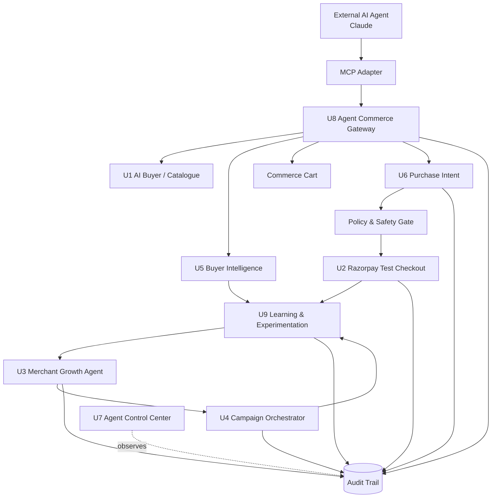
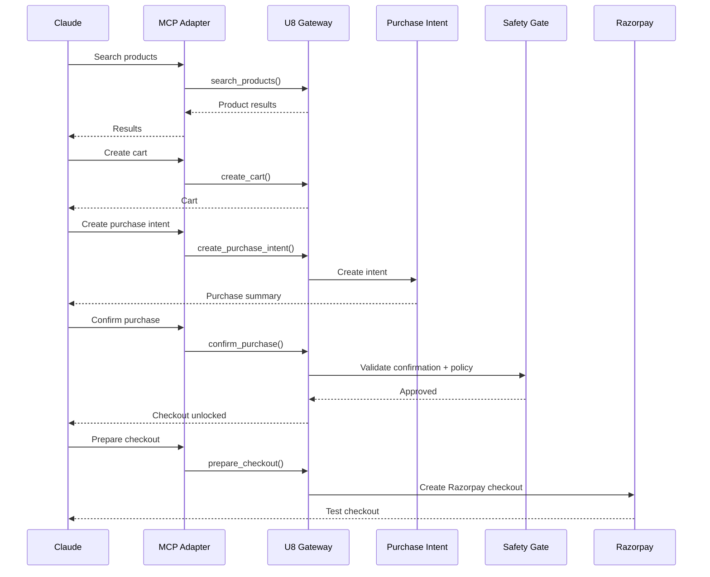
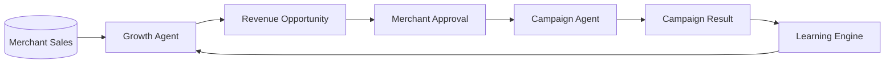

<div align="center">

#  RAYBOOST AI 

**The platform connects AI-driven product discovery, personalization, merchant growth, campaign execution, purchase intelligence and Razorpay-powered test checkout into one controlled commerce loop.**

*<i>Built For Razorpay AI Buildathon 2026 — Track 01<i>*
</div>

---

RAYBOOST tackles both sides of the problem:
> Grow the merchant's revenue, and make them sellable to AI buyers.
* **Grow the merchant's revenue** through AI-driven opportunities and campaign orchestration.
* **Make the merchant sellable to AI buyers** through an agent-readable commerce gateway and MCP integration.


The project focuses on two connected capabilities:
<div align="center">
    
### Merchant Growth

```text
Sales Data
    ↓
Growth Agent
    ↓
Revenue Opportunity
    ↓
Merchant Approval
    ↓
Campaign Orchestrator
    ↓
Campaign Result
```

### Agentic Commerce

```text
External AI Agent
        ↓
MCP
        ↓
RAYBOOST Commerce Gateway
        ↓
Product Discovery
        ↓
Cart
        ↓
Purchase Intent
        ↓
Buyer Confirmation
        ↓
Razorpay Test Checkout
```
---
</div>


## 📉 Business Problem

Traditional merchants are built for human-operated commerce:

```text
Search → Product Page → Cart → Checkout → Payment
```

AI agents change this interaction model.

An AI buyer can understand:

> "Find me a laptop suitable for programming under ₹70,000."

But for an AI agent to actually transact, the merchant needs machine-readable capabilities for:

* product discovery
* product information
* cart operations
* purchase intent
* checkout
* order status

At the same time, merchants need AI systems that can identify revenue opportunities and execute approved growth strategies.

RAYBOOST connects these two worlds.

---

#  What RAYBOOST Does 📈

RAYBOOST has two major sides.

## 1. Merchant Growth

The merchant side continuously turns transaction data into actionable growth opportunities.

```text
Merchant Sales
      ↓
Growth Intelligence
      ↓
Opportunity Detection
      ↓
Merchant Approval
      ↓
Campaign Execution
      ↓
Performance
      ↓
Learning
```

## 2. AI-Native Commerce

The commerce side allows an external AI agent to interact with the merchant.

```text
Claude
  ↓
MCP Adapter
  ↓
Agent Commerce Gateway
  ↓
Catalogue / Cart / Purchase
  ↓
Razorpay Checkout
```

---

# 🏗️ System Architecture



---

# 🔐 Safety Architecture

RAYBOOST does not give an LLM unrestricted authority over money movement.

The architecture separates **AI reasoning** from **financial execution**.

```text
AI Agent
   │
   │ proposes / requests
   ▼
Commerce Gateway
   │
   ▼
Policy Engine
   │
   ├── Max discount: 10%
   ├── Max automatic order: ₹1,00,000
   ├── Purchase confirmation required
   ├── Campaign approval required
   └── Payment verification required
   │
   ▼
Razorpay Test Checkout
```

### Trust Boundary

| Component            | Role                         | Money Execution |
| -------------------- | ---------------------------- | --------------- |
| External AI / Claude | Intent understanding         | ❌               |
| AI Buyer             | Discovery & recommendation   | ❌               |
| Growth Agent         | Revenue analysis             | ❌               |
| Campaign Agent       | Approved campaign execution  | Bounded         |
| Commerce Gateway     | AI-facing commerce interface | ❌               |
| Purchase Intent      | Purchase preparation         | ❌               |
| Policy Engine        | Deterministic validation     | ❌               |
| Buyer Confirmation   | Authorization gate           | Required        |
| Razorpay Checkout    | Payment execution            | ✅               |
| Audit Trail          | Immutable activity record    | ❌               |
| Control Center       | Monitoring                   | ❌               |
| Learning Agent       | Outcome analysis             | ❌               |

---

# 🤖 Agent System

## AI Buyer

Understands natural-language shopping requests and uses catalogue tools instead of relying only on LLM memory.

```text
User Request
    ↓
Search Catalogue
    ↓
Inspect Products
    ↓
Related Products
    ↓
Personalized Recommendation
```

## Merchant Growth Agent

Analyzes merchant sales data to identify opportunities such as:

* cross-sell opportunities
* product attachment opportunities
* revenue uplift opportunities

It proposes actions rather than directly spending merchant money.

## Campaign Orchestrator

Converts approved opportunities into bounded campaigns.

```text
Opportunity
     ↓
Merchant Approval
     ↓
Campaign Draft
     ↓
Guardrail Check
     ↓
Explicit Execute
     ↓
Campaign Result
```

## Buyer Intelligence

Uses first-party commerce activity such as:

* searches
* product views
* cart additions
* purchases
* preferred categories
* product relationships

to improve future recommendations.

## Checkout Agent

Controls the purchase lifecycle:

```text
Cart
 ↓
Purchase Review
 ↓
Buyer Confirmation
 ↓
Fingerprint Validation
 ↓
Policy Validation
 ↓
Razorpay Checkout
 ↓
Payment Verification
```

## Agent Control Center

Provides a unified view of:

* agent activity
* revenue intelligence
* guardrails
* campaign performance
* decision timeline
* feedback loops

## Agent Commerce Gateway

Makes the merchant machine-readable for external AI agents.

Capabilities include:

```text
Product Search
Product Details
Related Products
Recommendations
Cart
Purchase Intent
Purchase Confirmation
Checkout
Order Status
```

## Learning & Experimentation

Closes the feedback loop:

```text
Decision
   ↓
Experiment
   ↓
Execution
   ↓
Conversion
   ↓
Revenue Impact
   ↓
Learned Strategy
   ↓
Future Decision
```

---

# 🔌 Claude + MCP

RAYBOOST exposes its commerce capabilities through an MCP adapter so external AI agents can interact with the merchant.

```text
Claude
  │
  │ MCP
  ▼
RAYBOOST MCP Adapter
  │
  │ REST / JSON
  ▼
U8 Agent Commerce Gateway
  │
  ├── Catalogue
  ├── Cart
  ├── Purchase Intent
  └── Checkout
```

Example interaction:

```text
User:
"Find me a programming laptop under ₹70,000."

Claude
   ↓
search_products()
   ↓
get_product()
   ↓
recommend
   ↓
create_cart()
   ↓
add_to_cart()
```

Before payment:

```text
create_purchase_intent()
        ↓
review purchase
        ↓
explicit buyer confirmation
        ↓
prepare_checkout()
        ↓
Razorpay Test Checkout
```

---

# 💳 Razorpay Integration

RAYBOOST uses Razorpay Test Mode for the payment execution layer.

The payment flow includes:

* server-side amount calculation
* bounded discounts
* maximum order limits
* internal order IDs
* Razorpay order creation
* checkout
* signature verification
* success/failure handling
* retry support
* audit events

No production money is moved by the demo environment.

---

# 🛡️ Guardrails

RAYBOOST enforces explicit constraints.

| Guardrail                            |                     Limit |
| ------------------------------------ | ------------------------: |
| Maximum automatic discount           |                       10% |
| Maximum automatic order              |                 ₹1,00,000 |
| Buyer confirmation                   |                  Required |
| Campaign approval                    |                  Required |
| Payment verification                 |                  Required |
| Cart modification after confirmation |  Invalidates confirmation |
| Failed payment                       | Retry without losing cart |
| Duplicate checkout                   |                 Prevented |

The goal is simple:

> **AI can reason. Code decides what is allowed. Payment infrastructure executes only after the required gates pass.**

---

# 🔄 End-to-End Commerce Flow



---

# 📈 Revenue Growth Loop



---

# 🧩 Tech Stack

### Frontend

* React
* Vite
* CSS

### Backend

* Python
* FastAPI
* Pydantic

### AI

* Google Gemini
* AI Buyer
* Merchant Growth Agent
* Checkout Agent
* Learning Agent

### Agentic Interface

* Model Context Protocol (MCP)
* Claude Desktop
* RAYBOOST MCP Adapter

### Payments

* Razorpay Test Mode
* Razorpay Checkout
* Payment signature verification

### Data

* SQLite
* Audit event ledger

### Development

* Git
* GitHub
* Python virtual environment
* npm

---

# 🚀 Local Setup

## Backend

```bash
cd backend

python -m venv .venv

# Windows
.venv\Scripts\activate

pip install -r requirements.txt

uvicorn app.main:app --reload --port 8000
```

## Frontend

```bash
cd frontend

npm install

npm run dev
```

Open:

```text
http://localhost:5173
```

---

# 🤖 Claude / MCP Setup

Start RAYBOOST:

```bash
uvicorn app.main:app --reload --port 8000
```

Install MCP dependencies:

```bash
pip install -r mcp_adapter/requirements-mcp.txt
```

Configure Claude Desktop to launch:

```text
mcp_adapter/server.py
```

The MCP adapter connects Claude to:

```text
Claude
 ↓
MCP
 ↓
RAYBOOST U8
 ↓
Commerce APIs
```

See:

```text
docs/claude-mcp.md
```

for the complete setup.

---

# 🧪 Demo Scenario

### Merchant

RAYBOOST Demo Store

### AI Buyer

Claude

### Example request

```text
Find me a programming laptop under ₹70,000.
```

### Agent flow

```text
Discover merchant
       ↓
Search catalogue
       ↓
Inspect products
       ↓
Recommend
       ↓
Create cart
       ↓
Create purchase intent
       ↓
Buyer confirmation
       ↓
Razorpay Test Checkout
       ↓
Payment verification
       ↓
Audit Trail
```

---

# 💥 Failure Handling

RAYBOOST deliberately demonstrates graceful failure.

### Payment failure

```text
Payment Failed
     ↓
Cart Preserved
     ↓
Purchase State = FAILED
     ↓
Retry Available
```

### Cart changed after review

```text
Purchase Intent
       ↓
Cart fingerprint mismatch
       ↓
Checkout blocked
       ↓
User reviews updated cart
```

### Campaign failure

```text
Campaign Execution
       ↓
Failure
       ↓
FAILED state
       ↓
Retry
       ↓
Audit event
```

---

# 📊 What Makes RAYBOOST Agentic?

RAYBOOST is not simply an LLM chatbot.

The system combines:

```text
Perception
    ↓
Reasoning
    ↓
Tool Use
    ↓
State
    ↓
Policy
    ↓
Action
    ↓
Observation
    ↓
Learning
```

The agents interact with real application state through tools and APIs, while deterministic controls remain responsible for financial authorization.

---

# 🗺️ Roadmap

* [x] AI Buyer
* [x] Tool-driven Catalogue
* [x] Bounded Razorpay Checkout
* [x] Merchant Growth Agent
* [x] Campaign Orchestrator
* [x] Buyer Intelligence
* [x] AI Buyer Checkout Agent
* [x] Agent Control Center
* [x] Agent Commerce Gateway
* [x] Claude + MCP Integration
* [x] Learning & Experimentation Engine

---

# 🏆 Buildathon Alignment

| Track 01 Requirement      | RAYBOOST                     |
| ------------------------- | ---------------------------- |
| Grow merchant revenue     | Growth Agent + Campaigns     |
| AI-readable merchant      | Commerce Gateway             |
| AI buyer                  | AI Buyer + Claude            |
| End-to-end commerce       | Cart → Intent → Checkout     |
| Explainable money actions | Purchase summary + audit     |
| Bounded actions           | Policy limits                |
| Gated actions             | Buyer confirmation           |
| Audit trail               | Agent activity ledger        |
| Graceful failure          | Payment/campaign retry flows |

---

# 📸 Product Screenshots

Add screenshots here:

* AI Buyer
* Growth Agent
* Campaign Orchestrator
* Buyer Intelligence
* Agent Control Center
* Agent Commerce Gateway
* Claude + MCP
* Razorpay Test Checkout

---

# 🎥 Demo

**5-minute demo:**
`[Add video link]`

The demo covers:

1. Merchant revenue opportunity
2. Campaign approval
3. External AI agent discovering the merchant
4. Product recommendation
5. Cart creation
6. Purchase confirmation gate
7. Razorpay Test Checkout
8. Audit trail
9. Agent Control Center

---

# 📚 Documentation

* [Architecture](docs/architecture.md)
* [Agent Flow](docs/agent-flow.md)
* [Security & Guardrails](docs/security.md)
* [API Reference](docs/api.md)
* [Demo Script](docs/demo-script.md)

---

# ⚠️ Demo / Security Notes

This repository is configured for demonstration using Razorpay Test Mode.

Never commit:

```text
.env
API keys
Razorpay secrets
Gemini API keys
private credentials
local databases
```

Use `.env.example` as the configuration template.

---

# 👩‍💻 Built for Razorpay AI Buildathon 2026

**Track:** AI Growth & Agentic Commerce

**Core idea:** Make merchants discoverable, transactable and optimizable by AI agents — without giving AI unrestricted financial authority.

---
