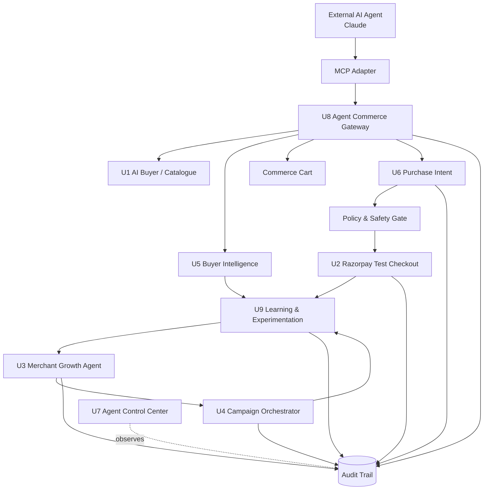
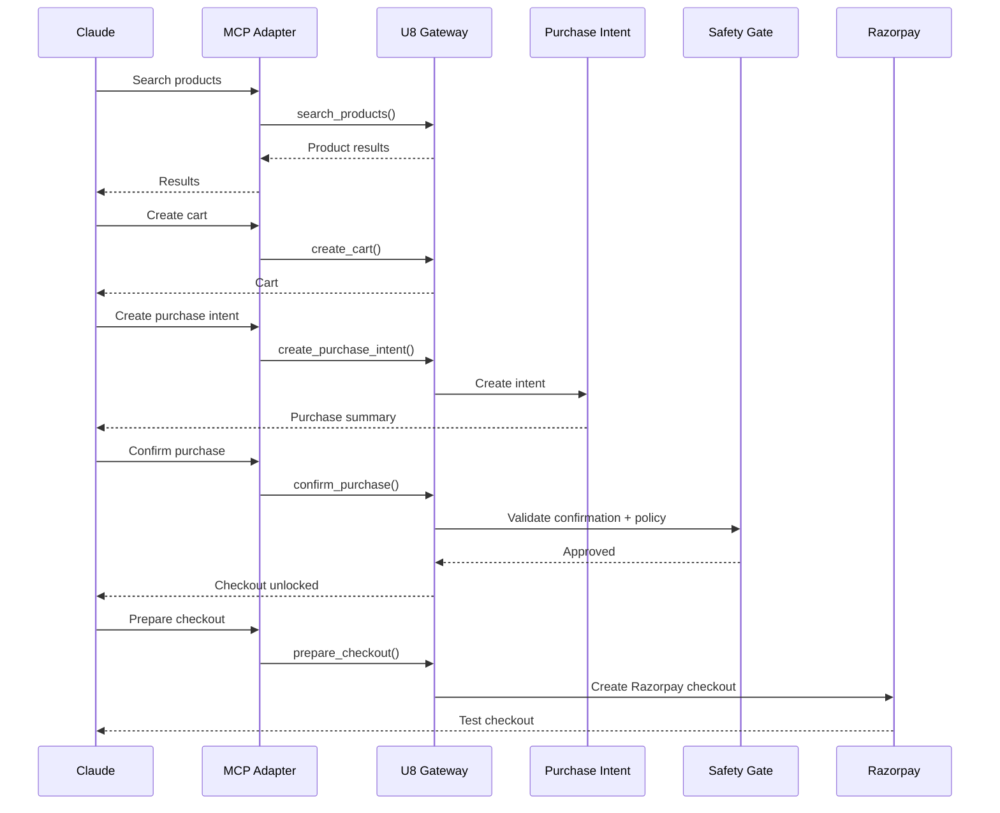
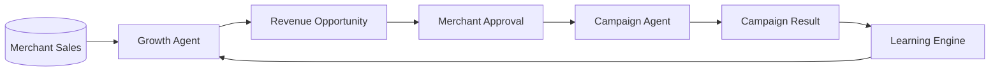

<div align="center">

# 🛍️ RAYBOOST AI 

**An AI-native commerce layer that lets AI agents discover, recommend, and buy from a merchant — while every money action stays bounded, explainable, and human-gated.**

*<i>Built For Razorpay AI Buildathon 2026 — Track 01<i>*
</div>

* Watch the Video Demo:  [Video](https://drive.google.com/file/d/12V8O-leI4xS5Eyc-1e6IUx28x-HaZ0Mo/view?usp=drive_link) 
* Step-by-Step Evolution: Explore the [Stage-by-Stage Codebase Here]() to see how the project was built from the ground up.

---
##  📉 Business Problem

>Traditional merchants are built for humans: `Search → Product Page → Cart → Checkout → Payment`. An AI agent can understand a request like *"find me a laptop under ₹70,000"*, but it has no machine-readable way to discover products, build a cart, or pay. Merchants also need a way to turn their own sales data into growth opportunities. RAYBOOST solves both:

- **Grow the merchant's revenue** — a growth agent turns sales data into merchant-approved campaigns.
- **Make the merchant AI-sellable** — an agent-readable commerce gateway (via MCP) lets external AI agents browse, cart, and check out through Razorpay.

##  📈 What RAYBOOST Does 

###  Merchant Growth 

```text
Merchant Sales
      ↓
Growth Intelligence
      ↓
Opportunity Detection
      ↓
Merchant Approval
      ↓
Campaign Execution
      ↓
Performance
      ↓
Learning
```
### Agentic Commerce
```text
Claude
  ↓
MCP Adapter
  ↓
Agent Commerce Gateway
  ↓
Catalogue / Cart / Purchase
  ↓
Razorpay Checkout
```

---
## 1.System Architecture


RAYBOOST separates **AI reasoning** from **financial execution**. An agent can propose a product, a cart, or a campaign — it can never move money. Every purchase passes through a deterministic policy engine before it reaches Razorpay.

| Component | Role | Money Execution |
|---|---|---|
| External AI / Claude | Intent understanding | No |
| AI Buyer | Discovery & recommendation | No |
| Growth Agent | Revenue analysis | No |
| Campaign Agent | Approved campaign execution | Bounded |
| Commerce Gateway | AI-facing commerce interface | No |
| Purchase Intent | Purchase preparation | No |
| Policy Engine | Deterministic validation | No |
| Buyer Confirmation | Authorization gate | Required |
| Razorpay Checkout | Payment execution | Yes |
| Audit Trail | Immutable activity record | No |

---
## 2.Agents

- **AI Buyer** — turns a natural-language request into catalogue search, product inspection, and a recommendation, using tools rather than model memory.
- **Merchant Growth Agent** — finds cross-sell, attach, and revenue-uplift opportunities and proposes them; it never spends merchant money directly.
- **Campaign Orchestrator** — converts a merchant-approved opportunity into a bounded, guardrail-checked campaign.
- **Buyer Intelligence** — learns from searches, views, cart activity, and purchases to improve future recommendations.
- **Checkout Agent** — drives cart → purchase review → buyer confirmation → policy check → Razorpay checkout → verification.
- **Agent Control Center** — a single view of agent activity, guardrails, campaign performance, and the decision timeline.
- **Agent Commerce Gateway** — the machine-readable surface (search, details, related products, cart, purchase intent, checkout, order status) that external agents call.
- **Learning & Experimentation** — closes the loop from decision to outcome to a learned strategy for the next decision.

---
## 3. Claude + MCP

Claude talks to RAYBOOST through an MCP adapter, which forwards calls to the Agent Commerce Gateway (`search_products`, `get_product`, `create_cart`, `add_to_cart`, `create_purchase_intent`, `confirm_purchase`, `prepare_checkout`). Every checkout still passes through the policy gate and requires explicit buyer confirmation before Razorpay is called.

## 4. Razorpay Integration

Runs on Razorpay Test Mode: server-side amount calculation, bounded discounts, order limits, order creation, checkout, signature verification, retry on failure, and an audit event per step. No production money moves in this demo.

---
## 5. 🛡️ Guardrails

RAYBOOST enforces explicit constraints.

| Guardrail                            |                     Limit |
| ------------------------------------ | ------------------------: |
| Maximum automatic discount           |                       10% |
| Maximum automatic order              |                 ₹1,00,000 |
| Buyer confirmation                   |                  Required |
| Campaign approval                    |                  Required |
| Payment verification                 |                  Required |
| Cart modification after confirmation |  Invalidates confirmation |
| Failed payment                       | Retry without losing cart |
| Duplicate checkout                   |                 Prevented |

The goal is simple:

> **AI can reason. Code decides what is allowed. Payment infrastructure executes only after the required gates pass.**

---

## 6.  End-to-End Commerce Flow



## 📈 Revenue Growth Loop



---

## 7.Tech Stack

- **Frontend:** React, Vite
- **Backend:** Python, FastAPI, Pydantic
- **AI:** Google Gemini — AI Buyer, Growth Agent, Checkout Agent, Learning Agent
- **Agentic interface:** Model Context Protocol (MCP), Claude Desktop, RAYBOOST MCP Adapter
- **Payments:** Razorpay Test Mode, signature verification
- **Data:** SQLite, audit event ledger

---
## 8. Local Setup & Quickstart Guide

### Prerequisites

* **Python 3.10+**
* **Node.js 18+ & npm**

### 1. Backend Setup & Launch

```bash
## Backend Setup & Launch

```bash
# Navigate to backend directory
cd backend

# Create virtual environment
python -m venv .venv

# Activate virtual environment (Windows)
.venv\Scripts\activate

# Install Python dependencies
pip install -r requirements.txt

# Start FastAPI server with live reload
uvicorn app.main:app --reload --port 8000
```
Open `http://localhost:5173`

### 2. Frontend Setup & Launch

```bash
# Navigate to frontend directory (in a new terminal window)
cd frontend

# Install npm packages
npm install

# Launch Vite development server
npm run dev
```
- Open `http://localhost:5173`

- Interactive API doc (Swagger UI) available at `http://127.0.0.1:8000/docs`

### Claude / MCP
```bash
pip install -r mcp_adapter/requirements-mcp.txt
```
Point Claude Desktop's MCP config at `mcp_adapter/server.py` — full steps in `docs/claude-mcp.md`.

---

## 9. Demo Scenario

Merchant: RAYBOOST Demo Store. AI Buyer: Claude. Request: *"Find me a programming laptop under ₹70,000."*

Flow: discover merchant → search catalogue → inspect products → recommend → create cart → create purchase intent → buyer confirmation → Razorpay test checkout → payment verification → audit trail.

### Failure Handling

- **Payment fails** → cart is preserved, purchase marked `FAILED`, retry available.
- **Cart changes after review** → fingerprint mismatch blocks checkout until the buyer re-reviews.
- **Campaign fails** → marked `FAILED`, retry supported, audit event recorded.

---

## 10. Buildathon Alignment

| Track 01 Requirement | RAYBOOST |
|---|---|
| Grow merchant revenue | Growth Agent + Campaigns |
| AI-readable merchant | Commerce Gateway |
| AI buyer | AI Buyer + Claude |
| End-to-end commerce | Cart → Intent → Checkout |
| Explainable money actions | Purchase summary + audit |
| Bounded actions | Policy limits |
| Gated actions | Buyer confirmation |
| Audit trail | Agent activity ledger |
| Graceful failure | Payment/campaign retry flows |

## 11. Roadmap

AI Buyer · Tool-driven catalogue · Bounded Razorpay checkout · Growth Agent · Campaign Orchestrator · Buyer Intelligence · Checkout Agent · Agent Control Center · Agent Commerce Gateway · Claude + MCP integration · Learning & Experimentation — all shipped.

## Security Notes

Runs on Razorpay Test Mode only. Never commit `.env`, API keys, Razorpay secrets, Gemini keys, or local databases — use `.env.example` as the template.

---
Built for Razorpay AI Buildathon 2026

**Track:** AI Growth & Agentic Commerce

**Core idea:** Make merchants discoverable, transactable and optimizable by AI agents — without giving AI unrestricted financial authority.

---


